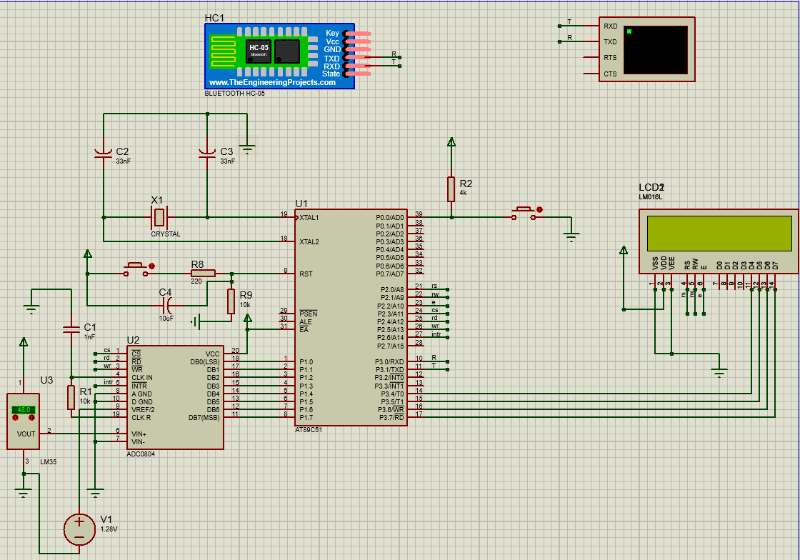

# LM35 Temperature Monitoring System

An embedded system using **AT89C51**, **LM35**, **ADC0804**, **LCD1602**, and **HC-05 Bluetooth**.

---

## Proteus Schematic



## ✨ Features

- 🌡️ Measure ambient temperature using the LM35 temperature sensor.
- 📟 Display real-time temperature on a 16x2 LCD.
- 📱 Monitor temperature through an Android application via HC-05 Bluetooth.
- 🔄 Support switching between Celsius and Fahrenheit.
- ⚙️ Implemented entirely in 8051 Assembly language.

## 🔧 Hardware

- AT89C51 Microcontroller
- LM35 Temperature Sensor
- ADC0804 Analog-to-Digital Converter
- LCD1602 Display
- HC-05 Bluetooth Module
- 11.0592 MHz Crystal Oscillator

## 💻 Software

- Proteus 8 Professional
- 8051 Assembly
- MIT App Inventor

## 📂 Project Structure

```text
LM35-Temperature-Monitor-8051
├── App
├── Demo
├── Images
├── Proteus
├── Source
└── README.md
```