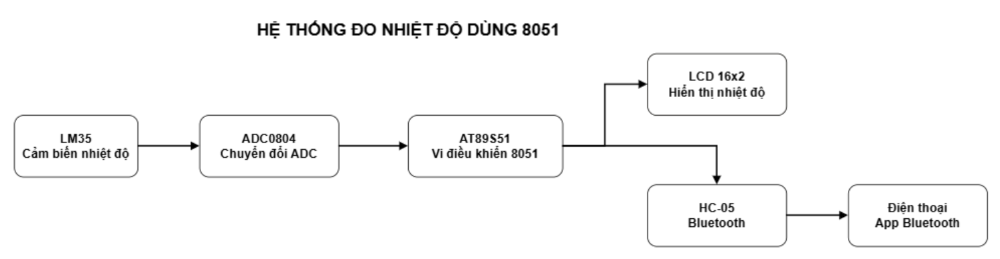
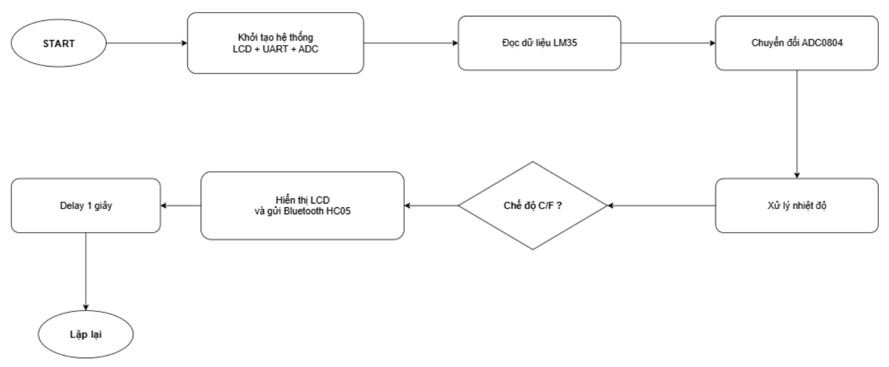
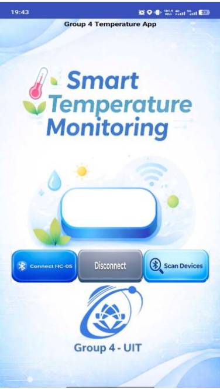

# 🌡️ LM35 Temperature Monitoring System

An embedded temperature monitoring system using **AT89C51**, **LM35**, **ADC0804**, **LCD1602**, and **HC-05 Bluetooth**. The system measures ambient temperature, displays the result on an LCD, and transmits real-time data to an Android application via Bluetooth.

---

## ✨ Features

- 🌡️ Measure ambient temperature using the LM35 sensor.
- 📟 Display real-time temperature on a 16×2 LCD.
- 📱 Monitor temperature through an Android application via HC-05 Bluetooth.
- 🔄 Support switching between Celsius and Fahrenheit.
- ⚙️ Developed entirely in **8051 Assembly**.

---

## 🖥️ Proteus Schematic


---

## 📐 Block Diagram



---

## 🔀 Flowchart



---

## 📱 Android Application



---

## 🎥 Demo Video

▶️ **[Watch the Project Demo](https://drive.google.com/file/d/1saqDFHmkJffhPnmAzrPmAOseg9m2e9gZ/view)**

---

## 🔧 Hardware

- AT89C51 Microcontroller
- LM35 Temperature Sensor
- ADC0804 Analog-to-Digital Converter
- LCD1602 (16×2 LCD Display)
- HC-05 Bluetooth Module
- 11.0592 MHz Crystal Oscillator

---

## 💻 Software

- 8051 Assembly
- Proteus 8 Professional
- MIT App Inventor

---

## 📂 Project Structure

```text
LM35-Temperature-Monitor-8051
├── Images
│   ├── app.png
│   ├── block_diagram.png
│   ├── flowchart.png
│   └── proteus.png
├── Proteus
│   └── LM35.pdsprj
├── Source
│   └── codelm35.asm
└── README.md
```

---

## 🚀 Getting Started

1. Open `Proteus/LM35.pdsprj`.
2. Build the Assembly source code.
3. Run the Proteus simulation.
4. Connect the Android application to the HC-05 Bluetooth module.
5. Monitor the temperature in real time.

---

## 📌 Results

- Accurate temperature measurement using the LM35 sensor.
- Real-time display on the LCD1602.
- Bluetooth communication with the Android application.
- Support for Celsius and Fahrenheit display modes.

---

## 👨‍💻 Author

**Nguyễn Trung Kiên**

- GitHub: https://github.com/kiennguyen198

> **Course Project**  
> This repository presents my implementation and learning outcomes from an embedded systems course project.